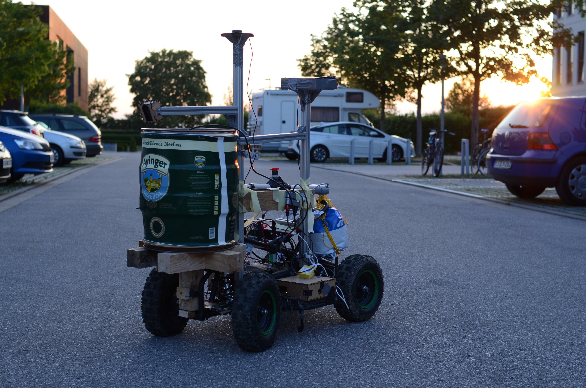
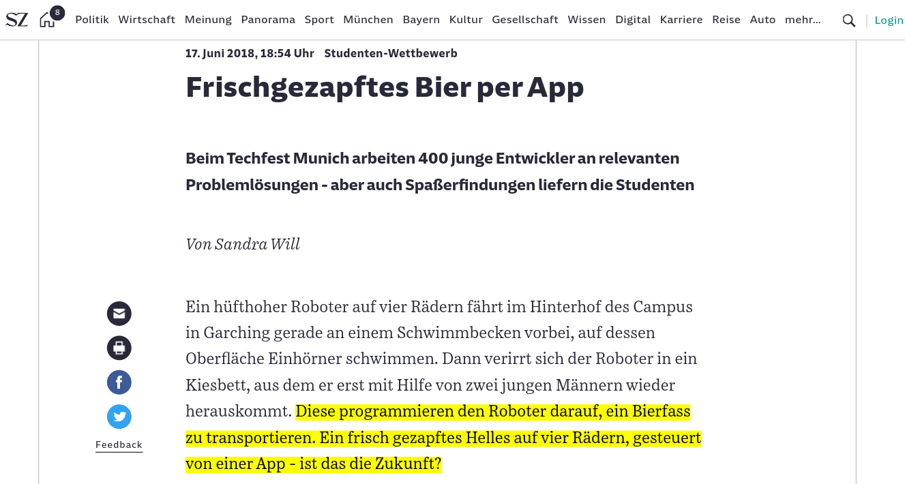

# Techfest Munich Hackathon 2018 - autonomousfest-2018-online.pdfbeer delivery robot

Track winner with autonomous beer delivery robot

We got also mentioned in the newspaper [Sueddeutsche Zeitung](https://www.sueddeutsche.de/muenchen/studenten-wettbewerb-frischgezapftes-bier-per-app-1.4019201).

## Idea

Use an app to deliver a fresh bier on the tap of a button. A fresh keggle drives to your gps location and let's you tap a beer.

## Presentation

[Presentation at Techfest](keggle-techfest-2018-online.pdf), which should be taken, of course, not totally serious ;)

## How

* Modify [cheap atv for children](https://www.amazon.de/Mini-Kinder-Elektro-Cobra-Pocket/dp/B00KOOO1OI) to be controlled with ROS
* Build telegram chatbot to drive to your GPS location
* Path planning & obstacle avoidance using ROS & stereo camera

## Code

Unfortunately, the code was not open sourced because part of the team was
thinking to continue the project for a different application.
